# DEPOT TEST-GR1250-A13
Ce dépot est un test dans le cadre du cours A13

## GitHub
1. initialiser un dépot
2. ajouter le gitignore
3. choisir une licence (MIT / GNU) 
4. ajouter des collaborateurs
5. commit 
6. branche
7. pull request
8. merge
9. gerer un conflit 
10. clone
11. pull
12. push
13. utliser github Desktop
14. configurer IDE Intelliji

### 1. initialiser un dépot
c'Est quoi ... .

### 2. ajouter le gitignore
J'ai ajouté le fichier .gitignore et j'ai rajouté dedans les fichiers à ignorer lors de mon ajout sur github.
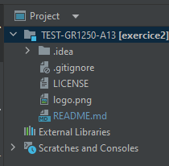

### 4. ajouter des collaborateurs
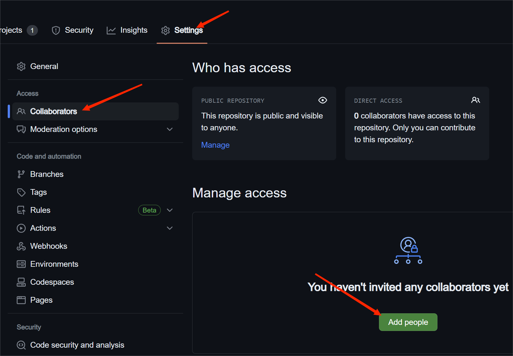
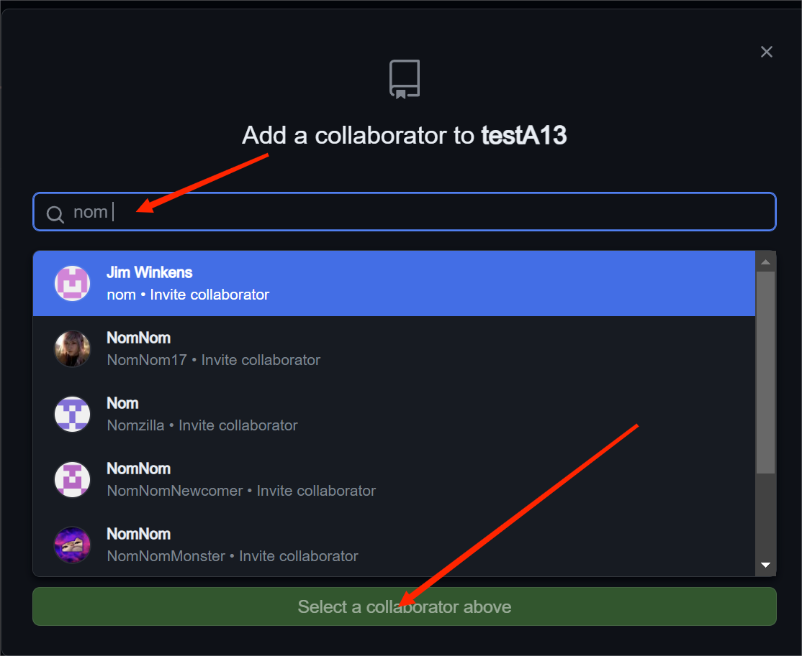
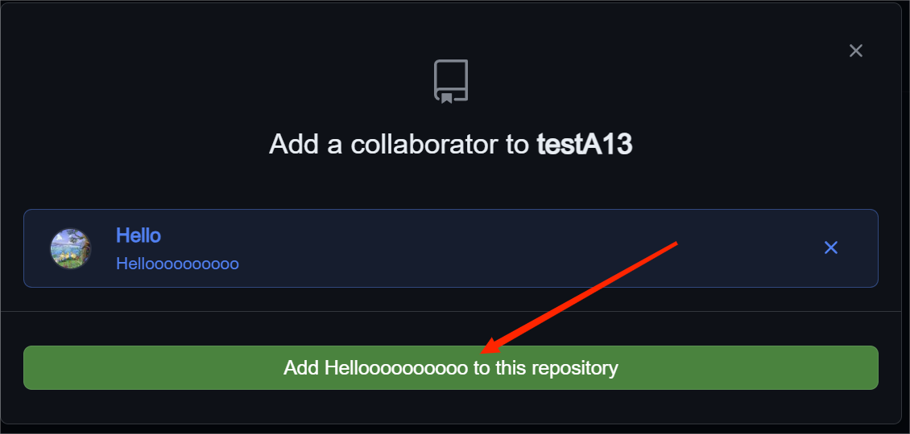

5. choisir une licence (MIT / GNU) 
6. ajouter des collaborateurs
### 7. commit 
-- faire un commit, c'est ajouter un commentaire sur le travail fait.
9. branche
10. pull request
### 6. gérer un conflit
Lors de la soumission d'un issue, un conflit peut apparaitre si la branche copie ne peut pas fusionner avec la branche main
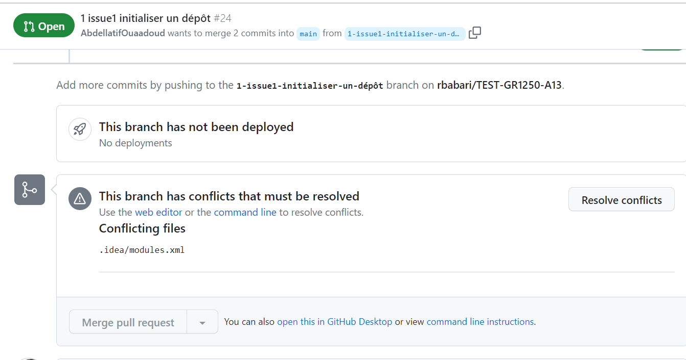
Il faut le resoudre soit en ligne de commande soit dans l'editeur en ligne et rajouter le .idea/modules.xml à .gitignore
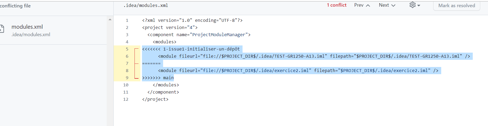
Suite à notre résolution du conflit, nous pourrions fusionner la branche conflit avec celle du main.
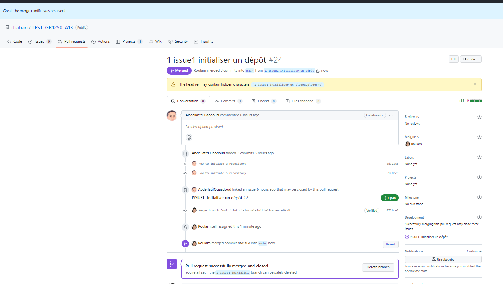
### 10. merge
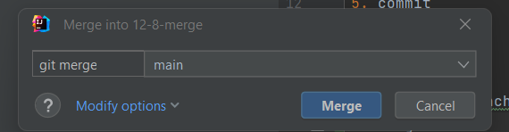      
12. gerer un conflit 
### 13. clone

- how to a clone : From the list of repositories, click the repository you want to clone. To select the local directory into which you want to clone the repository, next to the "Local Path" field, click Choose... and navigate to the directory. At the bottom of the "Clone a Repository" window, click Clone.
- sinon vous pouvez le faire sur Intelij directement

Premièrement, aller sur le repo et clicker sur le bouton code et copier le lien
        
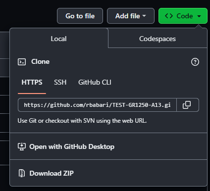
   
Deuxièmement, allez dans intelij et importer depuis version control

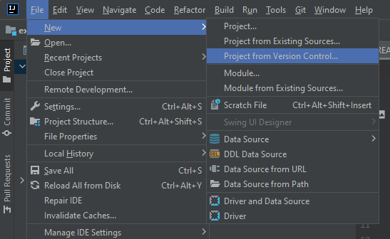
    
Troixièmement, copier le lien HTTPS dans l'espace réservé pour l'URL

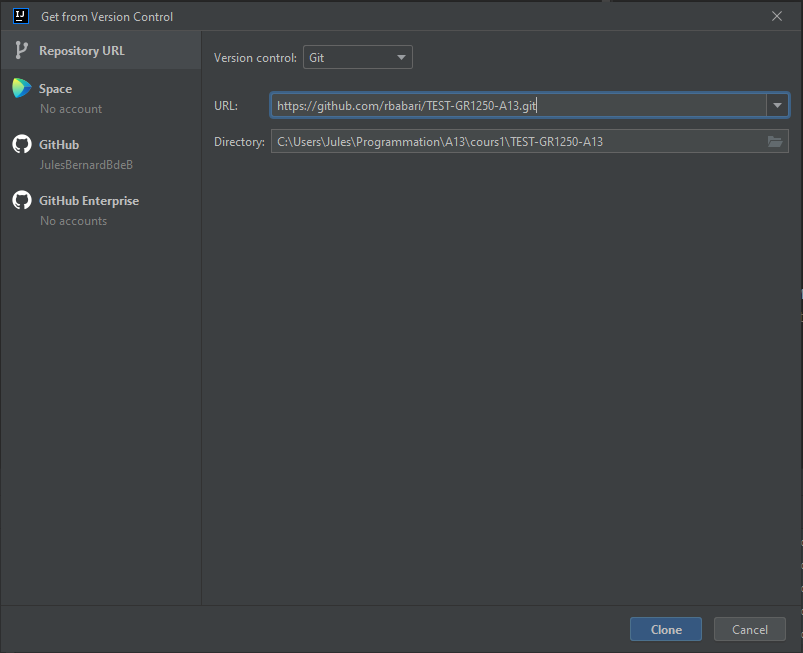
    
Finalement, allez dans votre branch

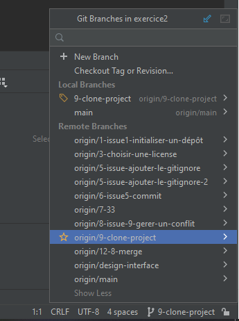

14. pull
15. push
16. utliser github Desktop
17. configurer IDE Intelliji

## Project
1. créer un projet : SPRINT
2. ajouter des collaborateurs
3. créer une board KANBAN ()
4. configurer les les priorité / taille
5. créer un issue (tâche : bug ou nouvelle fonctionalité)
6. associer un collaborateur à un issue
7. associe une branche à un issue
8. milestone (jalon : date de fin de print)
9. fermer un issue après un merge de la branche.

## Publier le raedme.md

1. activer le servereur web

2. integrer du html dans votre readme.md
