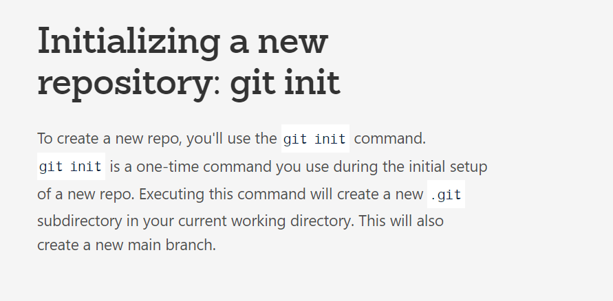

# DEPOT TEST-GR1250-A13
Ce dépot est un test dans le cadre du cours A13

## GitHub
1. initialiser un dépot
    <!--qu'est ce que initialiser un depot-->
    
2. ajouter le gitignore
3. choisir une licence (MIT / GNU) 
4. ajouter des collaborateurs
5. commit 
6. branche
7. pull request
8. merge
9. gerer un conflit 
10. clone
11. pull
12. push
13. utliser github Desktop
14. configurer IDE Intelliji

## Project
1. créer un projet : SPRINT
2. ajouter des collaborateurs
3. créer une board KANBAN ()
4. configurer les les priorité / taille
5. créer un issue (tâche : bug ou nouvelle fonctionalité)
6. associer un collaborateur à un issue
7. associe une branche à un issue
8. milestone (jalon : date de fin de print)
9. fermer un issue après un merge de la branche.

## Publier le raedme.md
1. activer le servereur web
2. integrer du html dans votre readme.md
